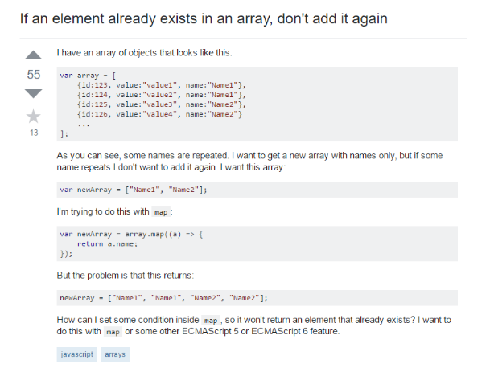
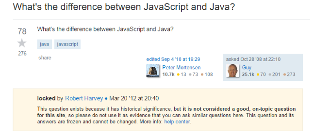

## How to Ask a "Smart" Question

As a member of the tech community, there will be many instances where you will need help. This is especially true for programmers. Thankfully, there is a very large and active online community where knowledge is freely shared. Crucial websites such as StackOverflow are open to programmers of any level, but there is an etiquette to posting questions. While these rules aren’t always enforced by moderators, it is frowned upon if you don’t ask questions in a “smart” way. This essay will analyze two different posts on StackOverflow and will shed light on the difference between a  “smart” and “not smart” question. 

Before even asking a question, it is important to see if the answer already exists online. Tactics such as google search or FAQs can be helpful. Laziness can be obvious and your question may go unanswered if people think that you’re not putting any effort in. In the event that you still can’t find the answer after researching, ensure that you post your question within the appropriate forum. For example, programming questions should be posted in StackOverflow and not SuperUser, which is meant for general-computing. Questions should also be posted with meaningful, specific subject headers. 

An example of a “smart” questions would be:

Notice that the question has an appropriate subject header and tags. The question then goes into more detail about what is happening and what the problem is. The question also is formatted correctly and provides code snippets. Since this was a “smart” question, the user received qaulity answers that provided different ways to solve the problem. 

Here is an example of a “not smart” question: 

There are many answers to this question already on the internet and can easily be located. As seen in the moderator comment in yellow, this post “is not considered a good, on-topic question” and was not appropriate for the site. Asking a question like this may get some slightly cheeky answers such as:

Asking questions is essential and it's important to have an open community that is will to share their knowledge. It's also equally important to be considerate enough to do your research and to formulate specific, thought-provoking questions. We all get stuck sometimes and having resources such as stack overflow makes all of our lives easier. So remember to post “smart” to increase the likelihood of your question getting answered. 
