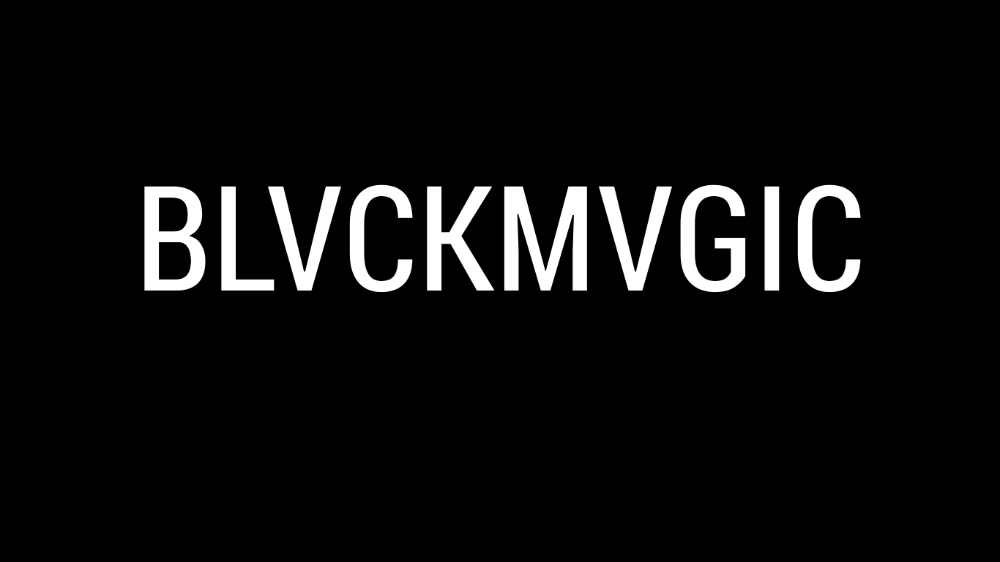

Create, send, and recieve encrypted messages hidden Steganographically within a photo. 

This application was developed in 2016 for the purpose of learning more about concepts that interested us. Mainly, this focused on encryption and steganography. Through this project we discovered how these techniques have been used in the past and what kind of impact they can have. 

*Due to concerns about use, full source code for the project will not be posted until further notice. Any inquiries about the project can be answered via email.*

