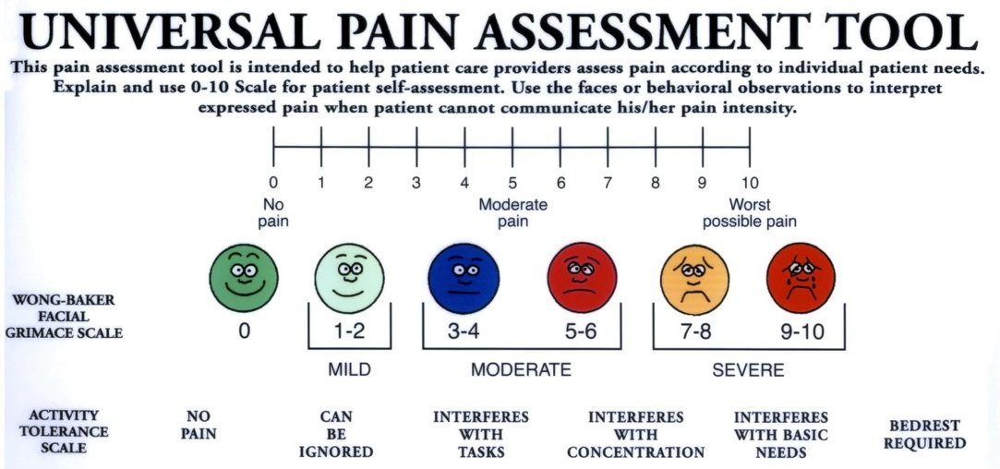

## Understanding Pain
Project for the John A. Burns School of Medicine (JABSOM) used to help doctors understand patient's pain. Doctors can track patients pain based on universal pain assesment tool. Data is stored online via google docs. My team and I volunteered to assist with the debugging of the application.
