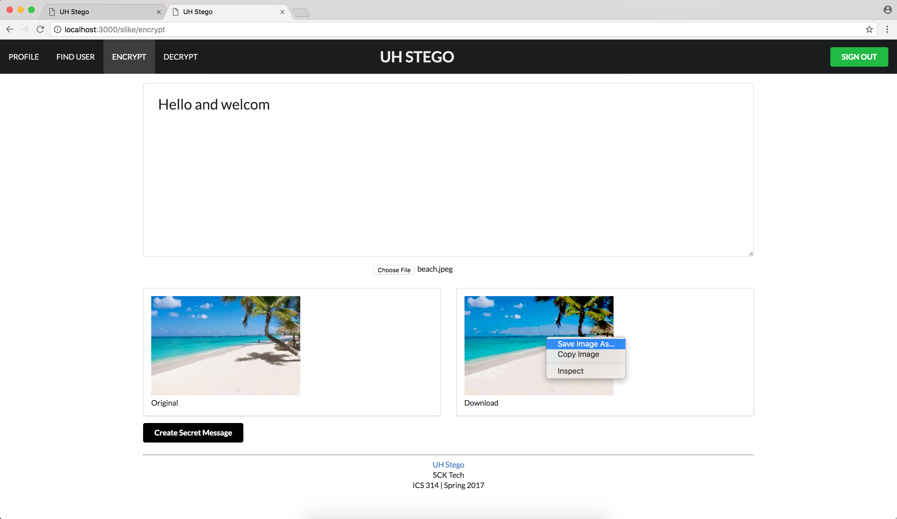

## About

UH students commonly send text messages to communicate, but sometimes SMS or instant chat is not secure enough. Truly sensitive data should be transported or hidden to ensure that it is not left exposed to nosey third parties. Our application allows students hide sensitive text messages or images steganographically. These doctored images can be used a transport media to deliver messages without raising any suspicion or attracting unwanted attention. Once in the hands of the proper recipient, the hidden message can be extracted.

## Development 

We used issue driven project management to complete the application. As a team, we planned three milestones during the development. These milestones were adjusted as time went on and depended on the progress we made. We reported and created issues within Github to fix bugs and perfect features.
 

While working on this project I had various roles. I pitched the idea to my teammates as I had some prior knowledge about steganography from another app I had worked on. During development, I focused a lot on front-end programming including the landing page, home page, nav bar, etc. I also assisted with profile page as well as the directory. While the application is functional and does encode/decode, it is far from finished. We plan to implement features such as encryption and direct messaging.

Visit us at our <a href="https://github.com/scktech">Github organization page.</a>
